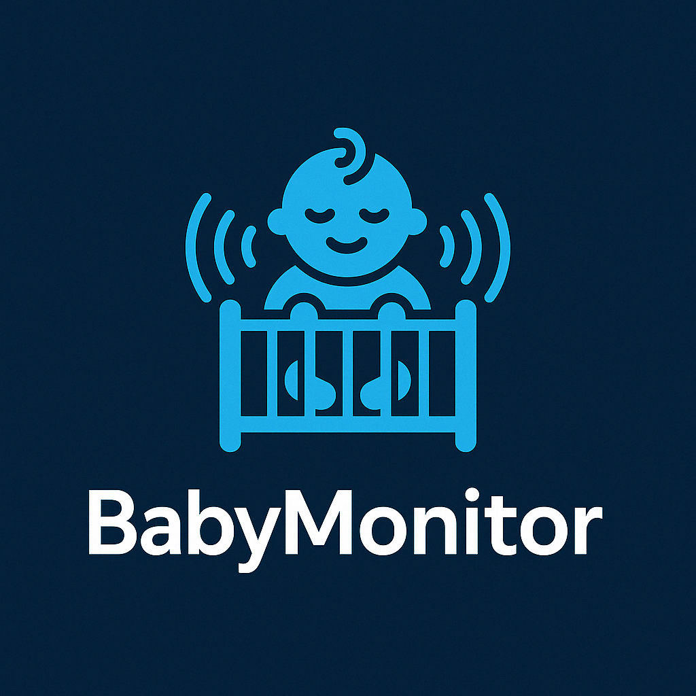
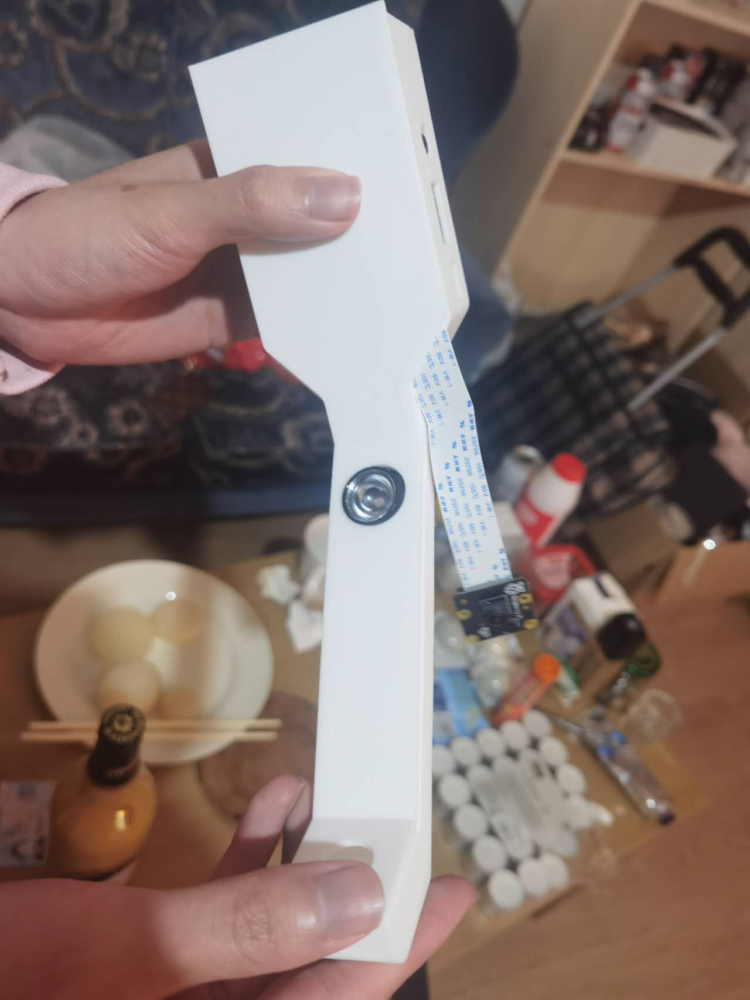

# 🛏️ Video-based baby monitor

**Video-based baby monitor** is a real-time embedded system based on Raspberry Pi, designed to monitor the sleep status of infants to ensure their safety. The system uses sensors to detect the infant’s movement, displays real-time data through a graphical interface, and provides alerts to notify caregivers of abnormal conditions.


[](https://qicoco97.github.io/UofG-RTEP-BabyMonitor/)
[](https://github.com/Qicoco97/UofG-RTEP-BabyMonitor/issues)
[](https://github.com/qicoco97/UofG-RTEP-BabyMonitor/stargazers)
[](https://x.com/babymonitor_gla)
[](https://www.tiktok.com/@congli.zhang)
[](https://youtu.be/0SxoRG_W2z0?feature=shared)
  
 
<p align="center">
  
</p>

## 📦 Project Structure

```bash
📂 UofG-RTEP-BabyMonitor
 ├── 📂 chassis           # 3D printing file
 │
 ├── 📂 docs              # Documentation and design files 
 │
 ├── 📂 img               # project image
 │
 ├── 📂 m4                # To generate configuration scripts for Autoconf
 │                  
 ├── 📂 src                    # Implementation files
 │   ├── Butterworth.cpp / .hpp       # Implements a Butterworth filter for signal/image smoothing
 │   ├── CommandLine.cpp / .hpp       # Parses and handles command-line arguments for the application
 │   ├── ComplexMat.hpp               # Defines complex matrix operations, likely used in Riesz Transform
 │   ├── INIReader.cpp / .h           # Handles reading configuration settings from .ini files
 │   ├── MotionDetection.cpp / .hpp   # Implements motion detection logic, likely frame differencing or filtering
 │   ├── RieszTransform.cpp / .hpp    # Applies Riesz Transform, often used for phase-based motion amplification
 │   ├── VideoSource.cpp / .hpp       # Abstraction for video input, handles camera or video file streams
 │   ├── WorkerThread.hpp             # Declares a multithreaded worker for background processing (e.g., motion detection)
 │   ├── ini.c / .h                   # Lightweight INI parser, probably a third-party or standalone config reader
 │   ├── main.cpp                     # Entry point for the application, likely initializes components and starts processing
 │
 ├── 📂 tests                  # project tests
 ├── CMakeLists.txt            # CMake build configuration
 ├── LICENSE                   # Apache v2.0 License
 ├── README.md                 # Project documentation
```


# Documentation

Please view our [Documentation Pages](https://qicoco97.github.io/UofG-RTEP-BabyMonitor/) for details and instructions on how to build the project.

## 📸 Demo & Promotion
<p align="center">
  
</p> real-time monitoring interface

Project is published on GitHub and received positive feedback.

Shared progress and results on social media platforms (Twitter, LinkedIn, etc.)[link].

## 📄 License & Acknowledgements
This project is licensed under the Apache-2.0 license. You are welcome to use and modify it in compliance with the terms. Thanks to the University of Glasgow for course support and to all supervisors and peers who contributed ideas and feedback during the development of this project.
