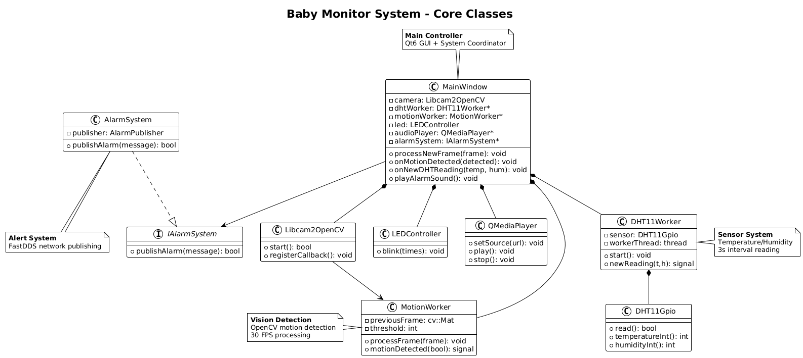
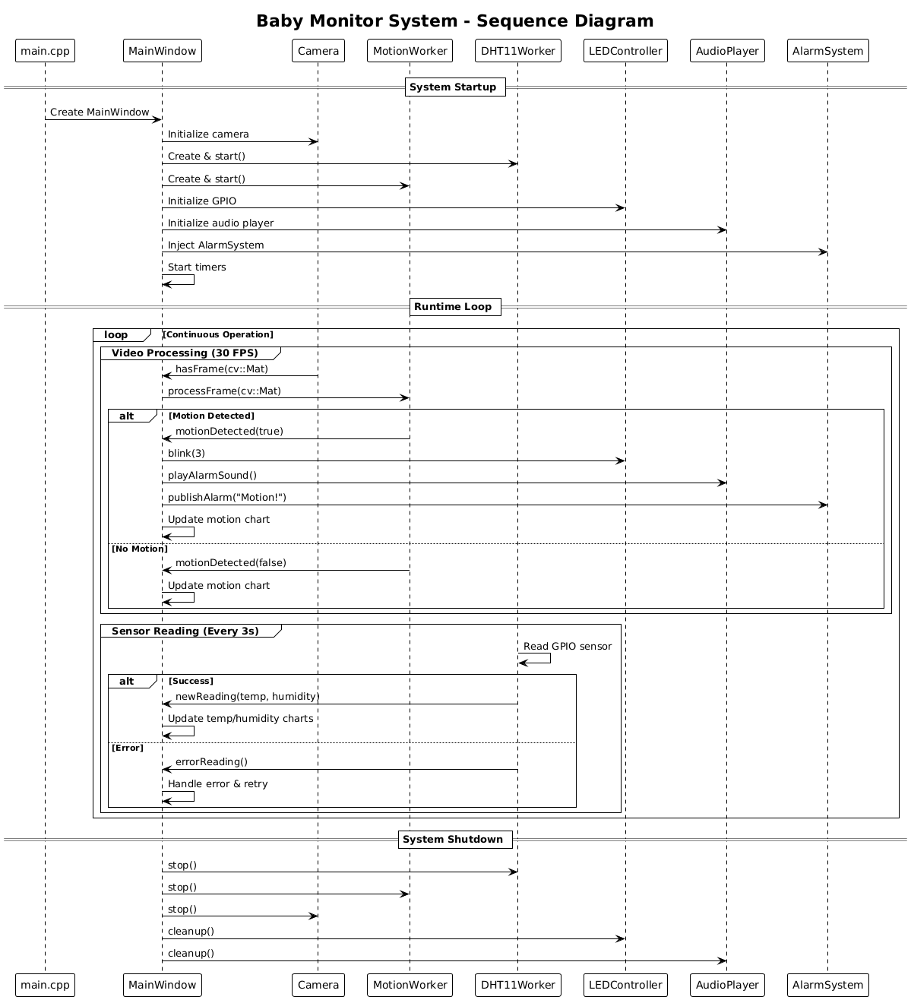

#### ** UML Class Diagram**

```
The system revolves around MainWindow as the main coordinator managing four key subsystems.
MainWindow orchestrates all subsystems including sensors, vision detection, alerts, and hardware control.
```

<p align="center">
  
</p>

#### ** UML Sequence Diagram**

```
This sequence diagram shows the temporal flow of the baby monitoring system from startup to runtime operation.
```

<p align="center">
  
</p>


