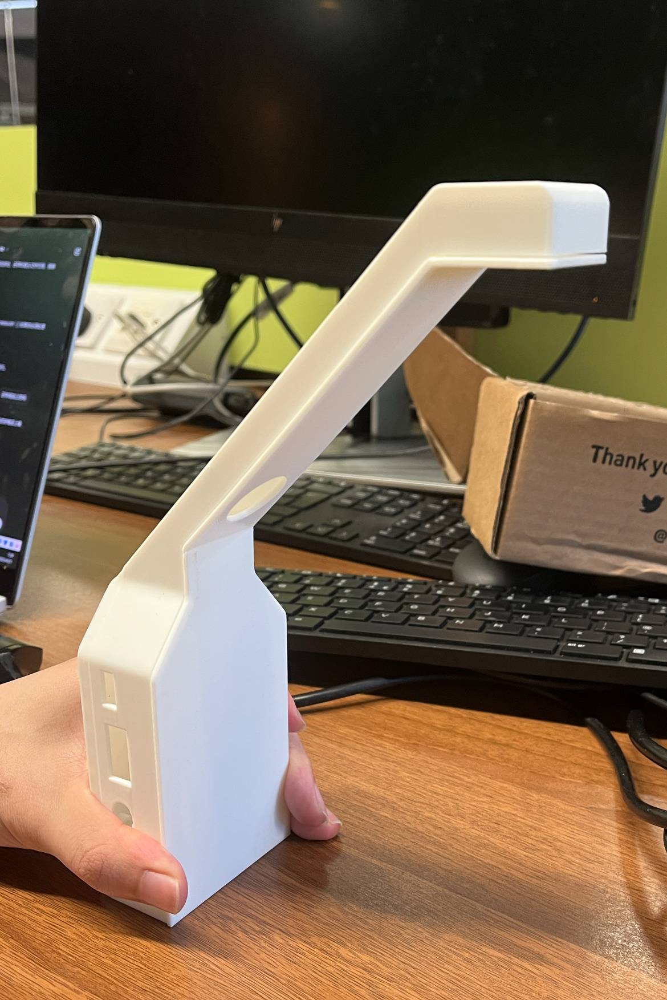

# Video-based Baby Monitor Overview

The baby monitor is a contactless, video-based baby monitor.

This project primarily uses a C++ implementation of the MIT [video enlargement](http://people.csail.mit.edu/mrub/vidmag/) algorithm that runs on a Raspberry Pi 3 Model B and is easily extensible.

You can setup your own baby monitor that raises an alarm if your infant stops moving.

## Getting Started

The baby monitor consists of two parts: baby monitor software and some simple hardware.
Learn how to use and recreate your own monitor in the following section.

### Software

To install prerequisites, build the software, or learn more about the software architecture, see [Software Installation Guide](setup/sw-setup.md).

### Hardware

To learn more about the hardware materials we used, and how we build our setup, check out the [Hardware Setup Guide](setup/hw-setup.md).

## Video Walkthroughs

<video width="640" height="360" controls>
  <source src="img/demo.mp4" type="video/mp4">
</video>

