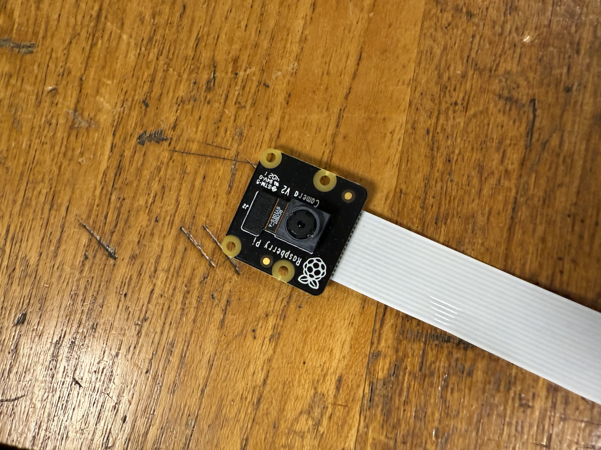
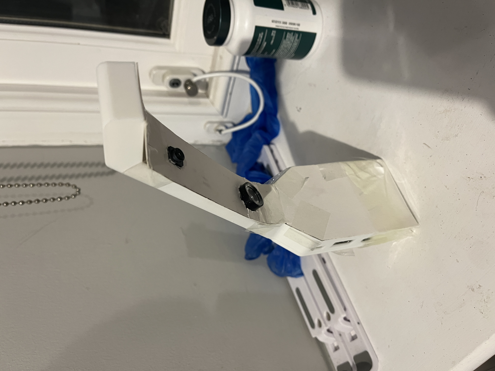

# Hardare Setup Guide

**Figure: Hardware Block Diagram**

Baby monitors are relatively simple to construct and consist mainly of commercially available components.

As shown above, there are 5 main hardware components, of which only 2 are customised.

This page contains installation instructions for the baby monitor.

## What you'll need

Raspberry Pi + Camera + configuration tools:

-   [Raspberry Pi 3 Model B](https://www.amazon.com/Raspberry-Pi-RASP-PI-3-Model-Motherboard/dp/B01CD5VC92/)
-   [5V 2.5A Micro USB Power Supply](https://www.amazon.com/gp/product/B00MARDJZ4/)
-   [Raspberry Pi NoIR Camera Module V2](https://www.amazon.com/Raspberry-Pi-NoIR-Camera-Module/dp/B01ER2SMHY)
-   [1W IR LED](https://www.amazon.com/DIYmall%C2%AE-Infrared-Adjustable-Resistor-Raspberry/dp/B00NUOO1HQ)
-   [MicroSD Card](https://www.amazon.com/Samsung-Class-Adapter-MB-MP32DA-AM/dp/B00IVPU7KE) (we used a Class 10 16GB card, the faster the card the better)
-   [Flex Cable for Raspberry Pi Camera (12")](https://www.adafruit.com/products/1648)
-   Speakers with 3.5mm input
-   HDMI monitor
-   USB Keyboard
-   USB Mouse
-   \[optional] [Raspberry Pi Heatsink](https://www.amazon.com/LoveRPi-Heatsink-Raspberry-Model-Heatsinks/dp/B018BGRDVS/) (If you're worried about heat, you can stick these onto your Pi.)

IR LED Circuit for low-light operation:

-   [\[3x\] 1N4001 diodes](https://www.adafruit.com/product/755)
-   [1 ohm, 1W resistor](http://www.parts-express.com/10-ohm-1w-flameproof-resistor-10-pcs--003-1)
-   [2x] 12" Wires with pin headers
-   Soldering iron

Chassis:

-   Access to a 3D printer (minimum build volume = 9.9" L x 7.8" W x 5.9" H) to print the chassis
-   Glue (any type of glue will will work, but hot glue is recommended for prototyping)

## Prerequisites

Before starting our step-by-step guide, you should have installed the latest version of [Raspbian](https://www.raspberrypi.org/downloads/raspbian/) on your SD card and made sure that your Pi boots properly.

You also need to [Enable Camera Module](https://www.raspberrypi.org/documentation/configuration/camera.md) before you can connect the camera.

## Build Instructions

### Swap NoIR Camera Cable

The 6-inch cable that came with the camera is too short.
Please replace the short (6-inch) cable with a long (12-inch) cable.

You can follow [this guide provided by ModMyPi](https://www.modmypi.com/blog/how-to-replace-the-raspberry-pi-camera-cable).

In short, the NoIR camera has a push/pull tab on the back of the camera, just like the one on the Pi itself:

Simply pull the black plastic tab out, remove the short cable and replace it with the long cable (make sure the blue plastic strip is facing up as shown), then push the plastic tab back in to secure the cable.

### 3D Printed Chassis

Use of our chassis is optional but recommended to prevent young children from touching exposed electronic circuitry.

Every cot is different, so our chassis does not include mounting brackets.

If you have access to a MakerBot Replicator (5th Generation), you can simply download the `.makerbot` files for the [case](https://github.com/Qicoco97/UofG-RTEP-BabyMonitor/raw/master/chassis/case.makerbot) and [cover](https://github.com/Qicoco97/UofG-RTEP-BabyMonitor/raw/master/chassis/cover.makerbot) onto your MakerBot Replicator and print.

If you are using a different type of 3D printer, please keep reading.

As mentioned above, printing a baby monitor requires a minimum volume of 9.9 inches (L) x 7.8 inches (W) x 5.9 inches (H).

If you don't have a 3D printer with this build volume, you can use an online 3D printing service such as [Shapeways](http://www.shapeways.com/) or [Sculpteo](https://www.sculpteo.com/) to print the baby monitor.

The minimum print resolution is 0.015 inches.

If you are using a [Fused Filament Manufacturing](https://en.wikipedia.org/wiki/Fused_filament_fabrication) type 3D printer, this means that your nozzle diameter needs to be 0.015 inches or less.

Printers with lower print resolution (larger nozzle diameter) may work, but the Raspberry Pi may not fit in the chassis.

We recommend Polylactic Acid (PLA) as the preferred printing material.

Other plastics can be used, but if the coefficient of thermal expansion of the chosen plastic is greater than that of PLA, the Raspberry Pi may not fit into the chassis.

Before proceeding, download the [enclosure](https://github.com/Qicoco97/UofG-RTEP-BabyMonitor/blob/master/chassis/case.stl) and [cover](https://github.com/Qicoco97/UofG-RTEP-BabyMonitor/blob/master/chassis/cover.stl) 3D files.

For instructions on orienting the 3D model in the printer build space, refer to the instruction manual that came with the 3D printer.

Examples of chassis and cover mounting orientations are shown below.

Case:

Cover:

In addition to placing the neck of the baby monitor flat on the build plate, you may also notice that the model is rotated around a vertical axis.

This may be necessary to load the model into the 3D printer build space.

If the build space is long enough to accommodate the baby monitor, rotation is optional.

### IR LED Circuit

To provide sufficient illumination at night, we use infrared LEDs, which are invisible to the human eye but visible to the NoIR camera.

The IR LEDs don't consume much power compared to the Raspberry Pi, so for simplicity we'll leave the IR LEDs on.

To power the LEDs through the GPIO pins on the Pi, we built the circuit shown below.

**Figure: LED Schematic**

For simplicity and backward compatibility, we use the 5V power pin, which can provide up to [1.5A](http://pinout.xyz/pinout/pin2_5v_power).

According to our measurements, the forward voltage of the infrared LED is about 1.7~1.9V.

Although their LED and ASA have a maximum current of 500MA, we decided to reduce the current to around 200MA to reduce heat and overall power consumption.

To bridge the gap between 5V and 1.9V, we decided to use three 1N4001 diodes and a 1 ohm resistor in series with the IR LED.

Therefore, the voltage across the IR LED is `5V - 0.2V - (3 * 0.9V) - 0.2V = 1.9V`.

The heat dissipation of each LED is 0.18W, and the heat dissipation of the resistor is 0.2W, both within the maximum ratings.

The circuit should looking something like this:

### Assembly: Bring it all together

Once you have all the hardware ready, you can start assembling.

You can use any glue for this process, but we recommend hot glue for two main reasons.

Hot glue dries quickly, so you don't need to wait long for the glue to dry.

In addition, if you make a mistake, hot glue is removable. To remove dried hot glue, soak the hot glue in in rubbing (isopropyl) alcohol.

Make sure everything is dry before reapplying the hot glue and powering up your Raspberry Pi.

Throughout the T and build process, check to make sure all T and ports are still accessible through the holes in the int and baby monitor chassis.

-   Insert the Raspberry Pi into the case. Once it is in place, make sure all ports are accessible (e.g., you can plug in the power supply).

-   Next, use some hot glue to secure the Raspberry Pi in place and mount the camera to the Raspberry Pi. There are also screw holes on the Raspberry Pi that you can use if you prefer.

-   Glue the LED and camera to the front cover.

-   First, glue the NoIR camera into the camera hole. Make sure the camera is firmly seated and aligned with the chassis. Do not use too much glue or the camera will not fit into the main case. Always power on the Raspberry Pi and check the camera (e.g., using `raspistill -v`) to make sure it is at the right angle and has a good field of view. If the angle is wrong, remove the hot glue and reposition it.

-   Next, glue an infrared LED light to the hole in the neck of the bedspread. It is at a 45-degree angle to the bedspread to illuminate the crib from the side and create more shadows in low-light environments. This will increase the contrast of the image and make it easier to detect motion.

-   Connect the infrared LED wires to the GPIO pins of the Raspberry Pi as shown in the LED schematic.
-   Place the cable into the chassis, being careful not to wrinkle or strain it.

-   Once everything is tucked in place, hot glue the edges where the two pieces meet to seal them in place.

