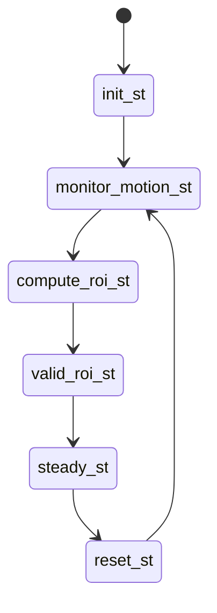

# Software Setup Guide

This is the step-by-step guide on building the video-based baby monitor software on Raspbian/Ubuntu.

## Prerequisites

This software depends on [autoconf](https://www.gnu.org/software/autoconf/autoconf.html), [libtool](https://www.gnu.org/software/libtool/), [OpenCV](http://opencv.org/) and [libcanberra](https://en.wikipedia.org/wiki/Libcanberra). Install these by running
> **NOTE**: For compatibility with the project code, Opencv version 2.4 needs to be installed. We provide steps on how to install Opencv version 2.4.13.5 at [troubleshooting page](./troubleshooting.md). If your environment does not have that version of Opencv, please complete the installation before the Build step.

```sh
sudo apt-get install git build-essential libtool autoconf libopencv-dev libcanberra-dev
```

Next, you need to add ‘bcm2835-v4l2’ to `/etc/modules-load.d/modules.conf` to set the camera driver to autoload.
Your `modules.conf` should look like this:

```sh
# /etc/modules: kernel modules to load at boot time.
#
# This file contains the names of kernel modules that should be loaded
# at boot time, one per line. Lines beginning with "#" are ignored.

i2c-dev
bcm2835-v4l2
```
After adding the line and saving the file, **reboot the Raspberry Pi**.

This is the driver for the monitor to acquire frames directly from the NoIR camera.


## Build

To build the software, navigate to the root of the software source directory and run

```sh
./autogen.sh --prefix=/usr --sysconfdir=/etc --disable-debug
make
sudo make install
sudo systemctl daemon-reload
```
## Usage 

To start the program in the background:

```sh
sudo systemctl start babymonitor
```

To run it in the foreground:

```sh
babymonitor --config /etc/babymonitor/config.ini
```

To start the program automatically at every boot:

```sh
sudo systemctl enable babymonitor
```

To stop baby monitor from automatically running at boot:

```sh
sudo systemctl disable babymonitor
```

Note that when `babymonitor` is started using `systemctl`, configuration parameters are sent and stored in `/etc/systemd/system/babymonitor.service`.

Once you have installed the software and have it configured well for your setting, you will no longer need the keyboard/mouse/monitor. Now, you can set your baby monitor to autorun at every boot as shown above.

Now, all you need to do is plug in the speaker, mount the baby monitor to the side of the cot in the previously tested position, and plug it in. The software will run automatically after a few moments and start tracking movements. However, you can unplug the speaker and let it continue to run (make sure to place the baby in the crib for a few minutes before plugging it back in). Do not unplug the Pi directly, as this may damage the SD card.

Keep in mind that you may need to reconfigure if the environment changes. You will need to disable the autorun feature using the above command and complete the calibration steps on the [configuration page](./config.md) on the calibration steps.

If there are problems, you can check our [troubleshooting page](./troubleshooting.md)

**Tip**: If everything is set up, you can [backup the Raspberry Pi SD card](https://www.raspberrypi.org/documentation/linux/filesystem/backup.md) for easy restoration in case something goes wrong.

## Software Configuration

The baby monitor can be customised with a simple INI configuration file.
After running `make install`, the configuration file is located at:

```sh
sudo nano /etc/babymonitor/config.ini
```

and it will look like this
```ini
[io]                  ; I/O configuration
; input = vid/noir_cam/lowres_10fps_orange_2min.h264   ; Input file to use
input_fps = 15          ; fps of input (40 max, 15 recommended if using camera)
full_fps = 4.5          ; fps at which full frames can be processed
crop_fps = 15           ; fps at which cropped frames can be processed
camera = 0              ; Camera to use
width = 640             ; Width of the input video
height = 480            ; Height of the input video
time_to_alarm = 10      ; How many seconds to wait with no motion before alarm.

[cropping]            ; Adaptive Cropping Settings
crop = true                 ; Whether or not to crop
frames_to_settle = 10       ; # frames to wait after reset before processing
roi_update_interval = 800   ; # frames between recalculating ROI
roi_window = 50             ; # frames to monitor before selecting ROI

[motion]              ; Motion Detection Settings
erode_dim = 4           ; dimension of the erode kernel
dilate_dim = 60         ; dimension of the dilate kernel
diff_threshold = 8      ; abs difference needed before recognizing change
duration = 1            ; # frames to maintain motion before flagging true
pixel_threshold = 5     ; # pixels that must be different to flag as motion
show_diff = false       ; display the diff between 3 frames

[magnification]       ; Video Magnification Settings
amplify = 25                ; The % amplification desired
low-cutoff = 0.5            ; The low frequency of the bandpass.
high-cutoff = 1.0           ; The high frequency of the bandpass.
threshold = 50              ; The phase threshold as % of pi.
show_magnification = false  ; Show the output frames of each magnification

[debug]
print_times = false ; Print analysis times

```

View all configuration details on the [Configuration page](./config.md) for full configuration details.

## Software Architecture Details
We saw some [video enlargement](http://people.csail.mit.edu/mrub/vidmag/) great demos from MIT and wanted to try running a similar algorithm on a Raspberry Pi.

In order to run in real-time on the Pi, the video zoom needs to be about 10 times faster than [tbl3rd's great work on its C++ implementation](https://github.com/tbl3rd/Pyramids).

The required optimisations guided the design of our software.

The software that handles the video stream is implemented as a state machine that runs in a loop as shown below.

There are currently six states that administer all of our processing steps.

Our state machine logic is called each time a new frame is read from the camera.



### Initialization

When a video stream is first opened, there is usually a flash of white or black pixels that looks like a lot of motion is occurring.

This state simply initialises the video zoom and motion detection code and skips a few frames before jumping to motion monitoring.

### Monitoring Motion

In this state, the complete 640 x 480 frame is zoomed in and the moving pixels between frames are calculated using the image differencing algorithm of Collins et al.

The output of this algorithm is a black and white image where white pixels indicate the pixels that have changed.

These black-and-white images are then bitwise summed to form a number of frames, thus accumulating the trajectory of the movement during this time.

### Computing a Region of Interest

Accumulated black-and-white frames represent the trajectory of motion over several frames, with slight erosion of the image to remove noise, and then a large zoom in to highlight the areas of most intense motion.

Dilation is necessary to merge discrete points into a continuous region of motion.

Because of the zoom in, it is easy to find the largest contour in the black and white image that represents the main source of motion and to draw a bounding box around the contour.

In this part of the code, we can set the boundaries of the crop size.

### Steady State

This is where we spend most of our software time.

In this state, the software runs on cropped frames.

Performs video zoom and calculates the amount of movement in the frame.

In this state, we were able to process fast enough to catch up with any delays incurred during full-frame processing and keep up with the 10fps video stream.

### Periodic Reset

Since babies may move occasionally, we reset the video zoom and crop periodically so that we can obtain full resolution frames to repeat the process of monitoring motion and finding new regions of interest.

All these timing parameters are easily configurable.

## Technical Challenges

### Speed

When we started this project, our C++ implementation could zoom in on video at 394,000 pixels per second on a Raspberry Pi 3.

For reference, this means that our code can only process a 640 x 480 video stream at approximately 1.3 frames per second.

Optimising the code for real-time was our primary goal and challenge, as we needed to increase the speed by a factor of 10 to handle at least 10 frames per second.

We are now able to process over 1,200,000 pixels per second and use additional cropping to process 10 fps video streams in real time.

We used three main optimisations to improve performance by a factor of 10: (1) multithreading, (2) adaptive cropping, and (3) compiler optimisations. Each optimisation is described in detail below.

#### Multithreading (~3x)

One of the intuitive and high-value optimisations is to process parts of each video frame in parallel.

To do this, we split each frame vertically so that the height of each section is one-third of the original frame.

Each section is then zoomed in, as if it were its own video stream.

The resulting zoomed frames are then joined together to form a full resolution frame before the motion frames are evaluated.

This one optimisation alone increased our processing speed to 938,000 pixels per second (roughly 3 times faster).

Three of the Raspberry Pi's four cores are dedicated to video amplification, while the fourth is responsible for control flow and motion processing.

#### Adaptive Cropping (~3x)

Multi-threaded techniques aim to increase the number of pixels we can process per second, while adaptive cropping techniques aim to reduce the number of pixels we need to process.

Our optimisation is based on two main assumptions.

Firstly, the camera's field of view captures the entire cot, with the baby being the only source of motion in the frame.

Secondly, the camera should be positioned so that movement can be discerned and the area of interest is no more than one third of the frame.

With these assumptions, we can regularly monitor full-frame images to determine where motion is occurring, and then crop the data stream so that it contains only relevant motion.

By reducing the number of pixels we process in steady state and amortising the cost of monitoring a few full-resolution frames, we were able to increase the number of frames that could be processed per second by about a factor of three.

#### Compiler Optimizations (~1.2x)

Finally, in order to achieve a speedup of more than 10x, we made some optimisations to the code and used additional compiler flags.

In particular, we use the -O3 optimisation level and force the compiler to generate vector instructions using `-ftree-vectorize` and `-mfpu=crypto-neon-fp-armv8`.

In addition, we need to add the `-funsafe-math-optimization` flag to enable vector floating-point generation, since NEON instructions are not IEEE compliant or gcc would not generate them.

We found that there are two major challenges to implementing compiler optimisation.

The first is to expose the operation to the compiler.

The most expensive part of the conversion occurs in the two all-pixel loops, but previously each operation in the loops was implemented by calling opencv to run the operation on all pixels.

On x86-64 machines, this is already an improvement because the cache is larger and the compiler always issues at least SSE2 vector instructions.

In contrast, converting from opencv code, which supports vector instructions, to straight C++ code gives worse performance on the Pi.

We recovered the performance degradation by adding compiler flags, but ran into toolchain issues.

The Pi 3 comes with an ARM Cortex A53 processor, an A-class 64-bit ARMv8 processor with NEON and cryptographic extensions, but it runs a 32-bit operating system compiled for ARMv7.

We first discovered that compiling with `-march=native` exposes a known but not yet fixed GCC bug.

Compiling with `-march=armv8` seems to work, but linking with ARMv7 libstdc++ generates ABI-incompatible binaries, leading to stack corruption.

On the other hand, from the assembler, it seems feasible to keep the default setting of `-march=armv7` and just force the FPU to generate NEON.

We also added `-mtune=cortex-a53` for better instruction scheduling and better loop unwind counting (enabled in -O3), but we suspect it has no effect because the version of GCC we're using (4.9.2, powered by Raspbian) doesn't recognise it.

### Profiling

In order to identify further optimisation points, profiling was used to determine where the code spent the most time.

In the process, we also ran into toolchain issues, as `valgrind` was unable to emulate the NEON vector instruction and crashed.

So we turned to `gprof`, but we found its timing a bit unreliable, despite the `-fno-inline` switch (on the other hand, function call counting is accurate, but not very useful).

Finally, we tried `perf`, which uses hardware performance counters to give us instruction-level timing, but we found that it was very accurate inside the conversion code and had zero data outside because it couldn't see samples of other code.

Overall, the analysis showed that 96% of the time was spent on transitions, 2% on motion detection, and the rest of the time was spent on threading and locking overheads and accessing the camera.

### Timing

Overall, our algorithm is able to process full 640x480 frames in 220 to 240 milliseconds, while in the worst case scenario after cropping (cropping to about 320x320), our algorithm runs in about 70 milliseconds per frame.

This way we can maintain a consistent 10 fps target.
